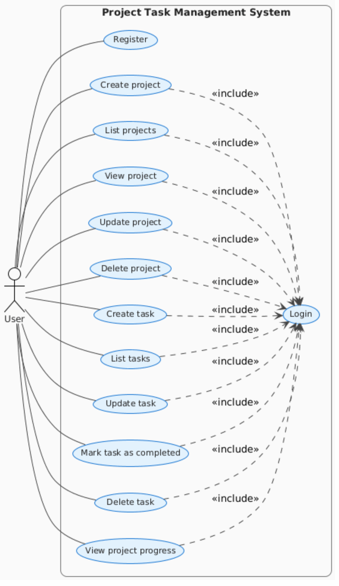
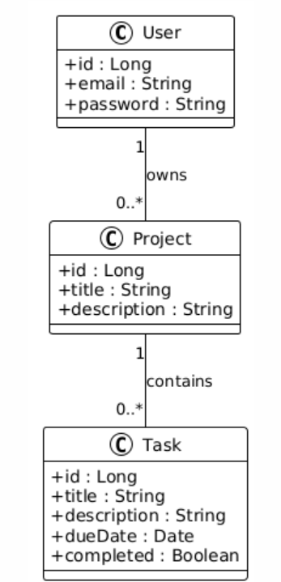

# Task Management Application – Full Stack Project

## Introduction

This project is a full-stack task management application that allows users to manage projects and their associated tasks. The application provides authentication, project and task management, and progress tracking, following clean architecture and modern development practices.

---

## Table of Contents

- [Functional Requirements](#functional-requirements)
- [Non-Functional Requirements](#non-functional-requirements)
- [Conception](#conception)
- [Technical Stack](#technical-stack)
- [Demo Video](#demo-video)
- [Getting Started](#getting-started)
  - [Prerequisites](#prerequisites)
  - [Steps to Run](#steps-to-run)

---

## Functional Requirements

### Authentication
- Login using email and password  
- JWT-based authentication  
- Secure token generation  
- All API endpoints (except login/register) are protected  

### Project Management
- Create a project  
- List all user projects  
- View project details  
- Update and delete projects  

### Task Management
- Create tasks  
- Mark tasks as completed  
- Delete tasks  
- List all tasks belonging to a project  

### Project Progress Tracking
- Automatic calculation of:
  - total tasks  
  - completed tasks  
  - progress percentage  
- Visual progress bar displayed in the UI  

---

## Non-Functional Requirements

### Security
- JWT authentication with expiration  
- Password encryption using BCrypt  
- Input validation using `@Valid`  
- Secure configuration using environment variables  

### Performance
- Optimized database queries with Spring Data JPA  
- Lazy loading of project tasks  
- Fast frontend build with Vite  

### User Experience
- Responsive UI (mobile and desktop)  
- Light and dark theme support  
- Clear error messages and user feedback  
- Smooth UI transitions  

### Maintainability
- Clean layered architecture (Controller / Service / Repository)  
- Reusable React components  
- Dockerized deployment for consistency  

---

## Conception

### Use Case Diagram

The use case diagram illustrates the main interactions between the user and the system, including authentication, project management, task management, and progress tracking.



### Class Diagram

The class diagram represents the core domain model of the application and the relationships between entities such as User, Project, and Task.



---

## Technical Stack

### Backend
- **Framework:** Spring Boot 3.4.x  
- **Language:** Java 17  
- **Security:** Spring Security + JWT  
- **Database:** PostgreSQL + Spring Data JPA  
- **Build Tool:** Maven  

### Frontend
- **Framework:** React 19  
- **Build Tool:** Vite  
- **Styling:** Tailwind CSS  
- **Routing:** React Router DOM  
- **HTTP Client:** Axios  

### Infrastructure
- **Containerization:** Docker and Docker Compose  
- **Web Server:** Nginx (production)  
- **Database:** PostgreSQL 15 (alpine)  

---

## Demo Video

🎥 **Application Demo**  
https://drive.google.com/drive/folders/1wSS1ANEZYncF2Lf3TYXc3WYjeXiNsSMI?usp=sharing

---

## Getting Started

### Prerequisites
- Docker and Docker Compose  
- Git  

### Steps to Run

```bash
# Step 1: Clone the Repository
git clone https://github.com/AsmaHmida99/task-management-app.git
cd task-management-app

# Step 2: Environment Variables Configuration
cp .env.example .env

# Edit the .env file and set your own values (database credentials, JWT secret, etc.).

# Step 3: Run the Application with Docker
docker-compose up --build


Application URLs
Frontend: http://localhost:3000
Backend API: http://localhost:8080
